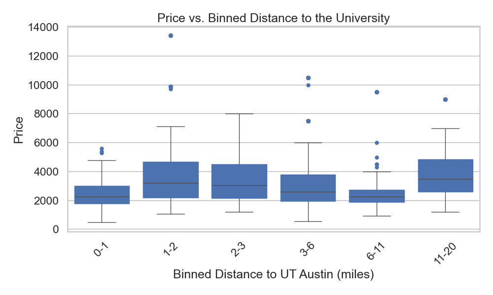
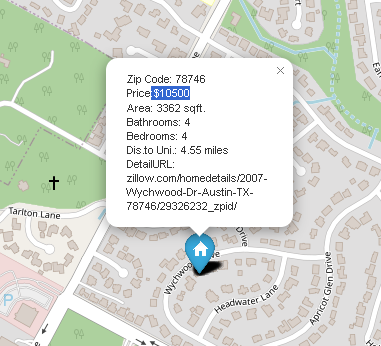

# Analysis of Apartments' Rent Prices in Austin, TX! (Especially for UT Students)

## A. Data Collection and Cleaning
 
***Source:*** Here is the link to the API we used to retrieve data (https://rapidapi.com/apimaker/api/zillow-com1). 

For a query conducted around 18:20 Mon Oct 9, 2023, this yielded approximately 2800 unique listings with no empty values in the column of important features we listed in the 'Code/get_zillowData.py'. The home type we chose is apartments for rent in Austin, TX. See the detailed setting of the parameters in the code mentioned above.

***Data Attributes' Selection:***
We chose 'Price', 'Latitude', 'Longitude', 'Address', 'Bathrooms', and 'Bedrooms' as our features. They can be retrieved by setting parameters in the 'initial_pull' function of 'get_zillowData.py', which means we can get those attributes directly from the API.

Also, there are some attributes that we computed and added to the dataset, which are 'Distance to University' and 'zip_code', for instances where the address provided in the query did not yield a zip code. These were both added using the Google leapis API and the code can be referenced in the get_lat_lon.py and get_zipcode.py files.

***Execution method:*** To execute the code and get the cleaned result.csv file (the data file that you can use for further analysis), you should run the following codes from the terminal in order: 

>> git clone [github SSH]

>> cd eco395m-project1-midterm

>> cd Code  

>> pip install -r requirements.txt

>> python3 data/get_zillowData.py

***Results you will get:***
* 6 CSV files named 'data_0, ... , data_5' that contain data for the first/second/.../sixth home type respectively.
* A CSV file named 'pre_result.csv', which combines the 6 CSV files above but contains some empty values in it.
* A CSV file named **'result.csv'**,[here](artifacts/result.csv) which is the **final result** of our data collection and cleaning.  

**Caution!** An error called 'KeyError: 'props'' may happen when you execute 'get_zillowData.py'. This is because of the unstableness of the API. You can run the code again until you can find a 'result.csv' file in your artifacts folder. We are really sorry for this, but sometimes the unstableness may occur for some API, hope you can understand, thanks!
 
   
***Things to Mention:***
 
* A successful execution of the code will last about **5-6 minutes** since we set up a sleep function for each loop to avoid reaching the request limit of the API. 

* There is a hidden .env file in the root directory and the /code directory with API keys for both the Google Maps and Zillow API. If you are receiving errors please reach out to me at **joewlimms1221@gmail.com** and I will share the API keys with you as they are under a paywall.

* If you are wondering why an attribute such as LivingArea is missing for some rows, the reason is that not every house for rent provides such an attribute publicly. Therefore, we may not get some attributes and will receive a CSV file with some missing values. That's why we need to clean the data. In the case that Zip is missing, it may be a failure from the get_zipcode.py file. However, the success rate for that query is relatively high. We will get the final CSV file under several trials.

## B. Price Regression Modelling

***Goals:*** To build a regression model to predict a house rent for apartments in Austin, TX given several attributes such as 'Zip Code', 'Living Area', 'Bathrooms', etc.

***Variables:*** We chose 'Zip', 'LivingArea', 'Bathrooms', 'Bedrooms', and 'Distance to the University' as X, and chose 'Price' as Y for our regression models.

***Model Selection:*** We tried several models, including parametric and non-parametric approaches. For machine learning methods, we conduct Random Forest(RF), Decision Tree(DT), and Support Vector Machines(SVM) methods. For regression models, we conduct Linear Regression(LR), Ridge Regression(RR), Bayesian Ridge Regression(BRR), Logistic Regression(LOG), and Polynomial Regression(PR) models.

***Model Comparison:*** We computed several model selection metrics to evaluate all eight models, including R Square, Adjusted R Squared, Mean Squared Error(MSE), Akaike Information Criterion(AIC), and Bayesian Information Criterion(BIC). After comparison, we found that the Random Forest model gives us the best result, and we will use it to conduct further prediction analysis.  

|  Model  |  R Squared  |  Adjusted R Squared  |  Mean Squared Error  |  AIC  |  BIC  |
|  ----  |  ----  |  ----  |  ----  |  ----  |  ----  |
| ***Random Forest*** | ***0.95411*** | 0.95370 | 179888.57504 | 6786.05203 | 6814.01965 |
| Decision Tree | 0.91308 | 0.91230 | 340709.73486 | 7143.72026 | 7171.68788 |
| Support Vector Machines | 0.71980 | 0.71726 | 1098409.01001 | 7799.24907 | 7827.21669 |
| Linear Regression | 0.65062 | 0.64746 | 1369569.77771 | 17762.41477 | 17790.38239 |
| Ridge Regression | 0.65056 | 0.64740 | 1369809.914018 | 7922.90222 | 7950.86984 |
| Bayesian Ridge Regression | 0.65048 | 0.64733 | 1370095.52937 | 7923.01897 | 7950.98659 |
| Logistic Regression | 0.75819 | 0.75601 | 947874.10893 | 7716.70711 | 7744.67473 |
| Polynomial Regression | 0.78914 | 0.76566 | 826570.17528 | 7742.02246 | 7990.71485 |

    
  
***Execution Method:***

>> cd ..

>> python3 Code/model/Random_Forest_regression.py

* After you run this code in your terminal, you will get a new CSV file named 'artifacts/result_with_predict.csv', which is added a column of our estimated price for the given data computed by our regression model. Also, you will see an R-Square Score of the test set we separated from the whole dataset printed in the terminal. The R-Square Score is around 0.954 for our Random Forest Model, which is really accurate.

***User Interactions:***
Our codes have a section for user interactions, after you see the printed R-Square score, you will find that your expected values of the attributes we used are required by our code in the terminal, please follow the instructions given in the 'Code/RT_train.py' to input your expected Zip, Living Area, number of bathrooms, etc. If you follow the instructions correctly, you will get a printed result that contains the estimated rent of your expected apartment. Below is an example result.

## C. Analysis

* ***Dataset Overview***

....................................

* ***Relation between prices and other attributes***

* We use Python to visualize the relationship, try to use the execution method below and you will get the following figures in the 'images' folder.

  
>> python3 Code/analysis/analysis.py

***A visualization Map***

* We built a map for visualizing all the attributes of an apartment for rent.

* Users can click on the blue house marker on the map to have a brief understanding of the house rent and other attributes in a geographical way. It can give users a more comprehensive and clear view of the apartments for rent in Austin.

* To view this map, please click [here](images/rent_price_map.html) and **downloading the .html file**. Then open it locally, and you can enjoy finding information in it.

* Here are some screenshots from the map to illustrate some examples from our findings above:

  

* If you want to run our codes to get this map for our or your own dataset, please follow the operations below:

>> python3 Code/visualization/get_price_map.py

  

## D. Results  
..........  

## E. Reproducibility

* ***Data:***
............
  
* ***Model:***
..............
  
* ***Analysis:***
.................
  
  

## F. Limitations

* ***Data Collection:*** Our project's primary data source was the Zillow API which is a comprehensive platform. However, it does not encapsulate the entirety of available rental listings. A significant portion of properties not listed on Zillow were omitted from our analysis.  Furthermore, we recognize that several influential factors went unaccounted for in our model. The furnishing status of a property, its age, available amenities such as swimming pools or gyms, security features, and specific landlord policies are all crucial determinants of rental pricing. Finally, the ever-changing nature of the rental market poses another limitation. The data we collected represents only a specific moment in time. As the rental landscape evolves, this snapshot might lose its relevance, making our model less reflective of future conditions.

* ***Modeling:*** We tried eight methods for modeling and picked out the best one with the highest R Square Score. However, we didn't do enough work on the feature selection and parameter setting part. One could get a more accurate estimation if he/she/they uses some metrics to delete some idle attributes or use grid search to find better parameters.

  
## G. Further Improvements
It is crucial to continue researching the improvement of distance metrics. Our first statistics lead us to believe that the 'distance to university' has little bearing on rental rates. However, because the university is close to the city center, it's possible that these two measurements will have overlapping effects. It is crucial to distinguish between the specific effects of being close to the institution and the more general attractiveness of being located downtown. We can also further refine the distance metric to better fit our model by introducing variables such as public transportation commute times or walkability indices. Additionally, our model might also be improved by using APIs to incorporate further variables, some of which were noted in our limitations section. Finally, we acknowledge the dynamic nature of rental markets. So, integrating a time series analysis is crucial to maintaining the correctness of our model and enables us to quickly adjust to markets or economies that are experiencing sharp volatility.

