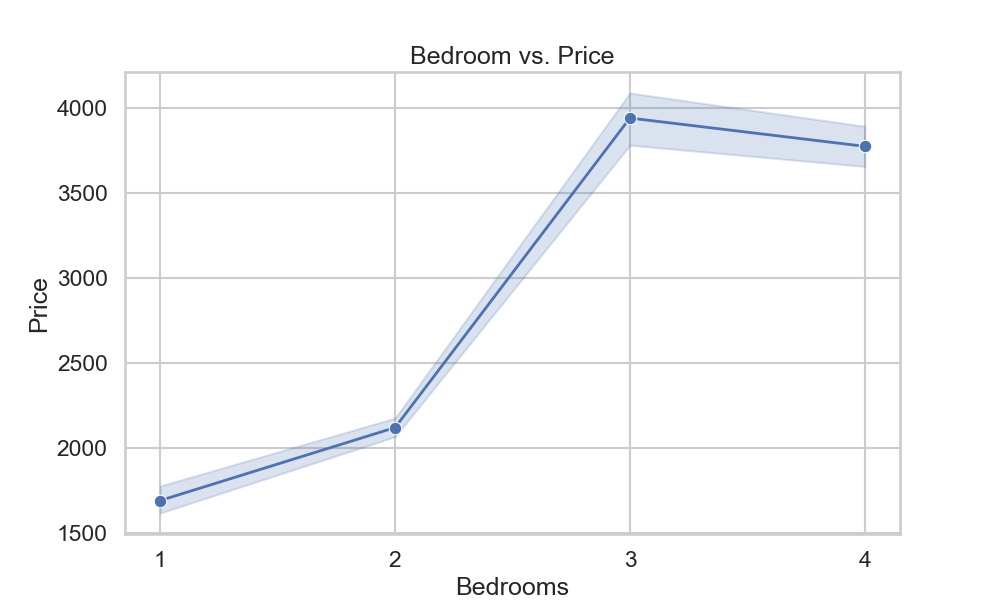
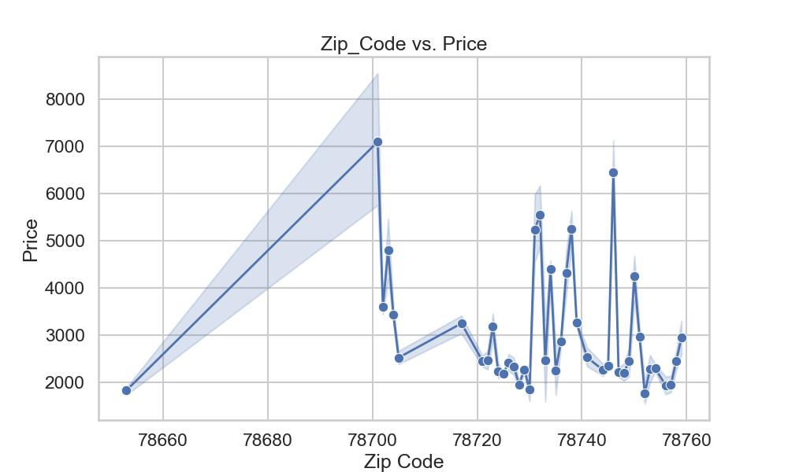

# Analysis of Apartments' Rent Prices in Austin, TX! (Especially for UT Students)

## A. Data Collection and Cleaning
 
* ***Source:*** Here is the link to the API we used to retrieve data (https://rapidapi.com/apimaker/api/zillow-com1). 

* For a query conducted around 18:20 Mon Oct 9, 2023, this yielded approximately 2800 unique listings with no empty values in the column of important features we listed in the 'Code/get_zillowData.py'. The home type we chose is apartments for rent in Austin, TX. See the detailed setting of the parameters in the code mentioned above.

* ***Data Attributes' Selection:***
* We chose 'Price', 'Latitude', 'Longitude', 'Address', 'Bathrooms', and 'Bedrooms' as our features. They can be retrieved by setting parameters in the 'initial_pull' function of 'get_zillowData.py', which means we can get those attributes directly from the API.
* Also, there are some attributes that we computed and added to the dataset, which are 'Distance to University' and 'zip_code', for instances where the address provided in the query did not yield a zip code. These were both added using the Google leapis API and the code can be referenced in the get_lat_lon.py and get_zipcode.py files.

* ***Execution method:*** To execute the code and get the cleaned result.csv file (the data file that you can use for further analysis), you should run the following codes from the terminal in order: 

>> git clone [github SSH]

>> cd eco395m-project1-midterm

>> cd Code  

>> pip install -r requirements.txt

>> python3 get_zillowData.py

* ***Results you will get:***
* 6 CSV files named 'data_0, ... , data_5' that contain data for the first/second/.../sixth home type respectively.
* A CSV file named 'pre_result.csv', which combines the 6 CSV files above but contains some empty values in it.
* A CSV file named **'result.csv'**,[here](artifacts/result.csv) which is the **final result** of our data collection and cleaning.  

* **Caution!** An error called 'KeyError: 'props'' may happen when you execute 'get_zillowData.py'. This is because of the unstableness of the API. You can run the code again until you can find a 'result.csv' file in your artifacts folder. We are really sorry for this, but sometimes the unstableness may occur for some API, hope you can understand, thanks!
 
   
* ***Something to Mention:***
 
* A successful execution of the code will last about 5 minutes since we set up a sleep function for each loop to avoid reaching the request limit of the API. 

* There is a hidden .env file in the root directory and the /code directory with API keys for both the Google Maps and Zillow API. If you are receiving errors please reach out to me at **joewlimms1221@gmail.com** and I will share the API keys with you as they are under a paywall.

* If you are wondering why an attribute such as LivingArea is missing for some rows, the reason is that not every house for rent provides such an attribute publicly. Therefore, we may not get some attributes and will receive a CSV file with some missing values. That's why we need to clean the data. In the case that Zip is missing, it may be a failure from the get_zipcode.py file. However, the success rate for that query is relatively high. We will get the final CSV file under several trials.

## B. Price Regression Modelling

* ***Goals:*** To build a regression model to predict a house rent for apartments in Austin, TX given several attributes such as 'Zip Code', 'Living Area', 'Bathrooms', etc.

* ***Variables:*** We chose 'Zip', 'LivingArea', 'Bathrooms', 'Bedrooms', and 'Distance to the University' as X, and chose 'Price' as Y for our regression models.

* ***Model Selection:*** We tried several regression models, which are Random Forest, Decision Tree, and linear regression.

* ***Model Comparison:*** We computed the R-Square score of each model as the evaluation metric. After comparison, we found that the .... model gives us the best result, and we will use it to conduct further prediction analysis.
  
  
* ***Execution Method:***

>> cd ..

>> python3 Code/RT_train.py

* After you run this code in your terminal, you will get a new CSV file named 'artifacts/result_with_predict.csv', which is added a column of our estimated price for the given data computed by our regression model. Also, you will see an R-Square Score of the test set we separated from the whole dataset printed in the terminal. The R-Square Score is around 0.954 for our Random Forest Model, which is really accurate.

* ***User Interactions:***
* Our codes have a section for user interactions, after you see the printed R-Square score, you will find that your expected values of the attributes we used are required by our code in the terminal, please follow the instructions given in the 'Code/RT_train.py' to input your expected Zip, Living Area, number of bathrooms, etc. If you follow the instructions correctly, you will get a printed result that contains the estimated rent of your expected apartment.

## C. Analysis

* ***Dataset Overview***

....................................

* ***Relation between prices and other attributes***

* We use Python to visualize the relationship, see the execution method and figures below.

  
>> python3 Code/draw_figures.py

You can also view the interactive Plotly scatter plot for the same figures by **downloading the .html file** in the 'images' folder, for example, [here](images/DISvsPRICE_scatter_plot.html).

* ***A visualization Map***

* We built a map for visualizing all the attributes of an apartment for rent, users can click on the blue house marker on the map to have a brief understanding of the house rent and other attributes. It can give users a more comprehensive view of the apartments for rent at Austin

  

## D. Results  

## E. Reproducibility

* ***Data:***

* ***Model:***

* ***Analysis:***

  

## F. Limitations

  
## G. Further Improvement

